# 最近任务 Agent 并发隔离 Review 与改进计划

## 目标

最近任务打开后，应成为稳定、独立、可恢复的 agent 实例。主 agent 与一个或多个最近任务 agent 可以同时运行；同一个实例内部串行，不同实例之间并行。

本阶段只做架构梳理和改进计划。确认后再改代码。

## 当前链路

```mermaid
flowchart LR
  A[最近任务点击] --> B[Project Tab]
  B --> C[sessionKey: desktop-user:projectPath]
  C --> D[Wails SendAIAssistantMessage]
  D --> E[userID: desktop-user:projectPath]
  E --> F[runAIAssistantMessageAsyncForUser goroutine]
  F --> G[IM sessionLoopState keyed by userID]
  G --> H[LoopContext Runtime PolicyOwnerID]
  H --> I[tools / skill / MCP / browser / memory / LLM]
```

主 agent 使用 `desktop-user`。最近任务 agent 使用 `desktop-user:{projectPath}`。原则上，这两个 userID 就是隔离边界。

## 必须成立的不变量

1. 前端状态按 `sessionKey` 隔离：busy、progress、input lock、预输入队列、附件、cancel、stream request 映射，都不能用全局状态兜底。
2. 后端 agent loop 按 `userID` 隔离：同一个 userID 串行，两个不同 userID 并行。
3. 工具运行时必须携带 owner：`PolicyOwnerID` / `WorkflowOwnerID` / `_skill_owner_id` / MCP owner，不能读“当前全局 loop”。
4. 最近任务身份稳定：同一个最近任务重复打开，应复用同一个任务实例或激活同一 tab，不再 fork 新任务。
5. 关闭 tab 不等于删除任务：任务仍可从最近任务恢复；删除必须是显式动作。
6. 共享资源必须有并发契约：能 owner-scoped 就 owner-scoped；必须共享时，只允许短锁，不允许长 I/O 持锁。

## 分层 Review 结论

| 层 | 当前观察 | 风险判断 | 改进方向 |
| --- | --- | --- | --- |
| 前端 tab/input | `AIAssistantPanel` 已用 `activeSessionKey`，`useBufferQueue`、附件、busy 集合也已按 session 走 | 仍需防止事件无 `request_id` 时落到当前 tab；已有一次修复，但要补更强测试 | 建立 `sessionKey` 单一事实源；禁止 active tab fallback 污染 detached session |
| 最近任务身份 | `useAITabManager` 对 project path 有 deterministic tab id，重复打开倾向激活已有 tab | 程序重启后 tab 名、任务实例映射可能丢，导致“像 fork 新任务” | 持久化 task instance id、display title、projectPath -> ownerID 映射 |
| Wails 请求 | `SendAIAssistantMessage` 根据 `project_path` 生成 `desktop-user:{path}`，并 goroutine 执行 | 请求入口不是瓶颈 | 日志加 requestID/sessionKey/projectPath，测排队时间 |
| IM loop 串行边界 | `im_entry_serialization.go` 用 `sessionLoopState.mu`，按 `msg.UserID` 串行 | 原理正确：同 owner 串行，不同 owner 并行 | 加并发测试：主 agent + 2 project agent 不互等 |
| LoopContext 全局遗留 | `currentLoopCtx`、`lastUserID` 仍存在，`beginAgentLoopRuntime` 会被并发 loop 覆盖 | 高风险：工具若读 legacy global，可能串 owner、错 busy、错工作目录、错策略 | 消灭 agent loop 内 legacy 依赖；工具调用显式传 `LoopContext` 或 owner |
| cancel/injection | 已有 per-user `pendingInjection`、`CancelSessionForUser` | fallback 到 legacy 时仍有风险 | 禁止 desktop/project 走 legacy fallback；缺 owner 直接 fail closed |
| Skill runner | `StartRunForOwner` 注入 owner，run 异步；本体不应单实例串行 | `SkillExecutor.mu` 在 load/update stats 时短锁；`saveSkills` 在锁内，可能造成完成阶段短阻塞。`skillStepProcessEnvMu` 会让使用进程环境的 step 串行 | 执行阶段不持全局锁；usage stats 改成短锁快照 + 原子保存队列；进程 env 改 per-process env，不用全局 env lock |
| Local MCP | owner-scoped client/process，start lock keyed by serverID+ownerID | 原理接近正确；同 owner/server 启动串行，跨 owner 并行 | 压测多 owner 同时 `CallToolForOwner`；日志记录 start wait/call elapsed |
| Remote MCP | HTTP session 用 `serverID + ownerID` 隔离 | `ensureSession` 无 per-owner singleflight，两个同 owner 首次调用可能重复 init；跨 owner不该互斥 | 加 per `(serverID, ownerID)` init singleflight；保留跨 owner 并行 |
| Browser tools | `browser_session_start` 默认 `reuse_existing=true`，persistent 模式被当成 singleton 复用 | 高风险：多个 agent 默认拿同一个 browser session/page，表现成互相影响或排队 | browser 默认 session 必须 owner-scoped；同 owner 复用，不同 owner 独立 page/session/profile |
| Memory recall | conversation memory by userID；memory store 有全局 store lock。`queryEmbeddingCached` 已 singleflight，不是全局长锁 | store 写仍串行；recall通常可并发读。embedding 同 query 等待同 flight 是合理的 | 加 recall timing log；确认无 `s.mu` 持锁调用 LLM/embedding |
| Workflow engine | `WorkflowEngine.mu` 是全局锁，许多操作在锁内 | 如果锁内只操作状态，影响小；如果锁内做生成、保存、回调，会阻塞多 agent workflow | 审计锁内长 I/O；改成按 `userID` state lock 或快照后锁外执行 |
| Background LLM | `backgroundLLMCancel` 是单全局 cancel func | 高风险：一个 session 新消息可能取消另一个 session 的后台抽取/去重 | 改为 `backgroundLLMCancelByUser sync.Map`，只取消同 owner 后台任务 |
| LLM HTTP | chat transport `MaxConnsPerHost=20` | 内部连接池不是单连接瓶颈；外部供应商可能限流 | 日志区分 internal wait、first token、429/rate limit |

## 最可能导致“还在互相影响/变慢”的根因

1. Browser 默认 singleton：`StartAgentSession` 在 persistent 模式下总会复用已有 session。多个 agent 做浏览器任务时会抢同一页。
2. Legacy global loop：`currentLoopCtx/lastUserID` 会被最后启动的 loop 覆盖。任何还读它的工具都会错 owner。
3. Global background cancel：新请求会取消全局后台 LLM 任务，跨 agent 有副作用。
4. WorkflowEngine 全局 mutex：如果 workflow 阶段里有长操作，会让多个 agent 的 workflow 互等。
5. Skill runner 小锁和全局 env lock：不是主循环互斥，但高并发 skill 完成/使用进程 env 时会有短排队。

## 改进计划

### Phase 0: 观测与验收基线

- 增加统一日志字段：`request_id`、`session_key`、`owner_id`、`project_path`、`loop_id`、`tool`、`elapsed`、`wait_elapsed`。
- 记录关键阶段：frontend submit、Wails accept、serialization wait、loop start/end、LLM first token、tool start/end、skill run start/end、MCP init/call、browser session start/use、memory recall。
- 加并发 smoke：主 agent + 两个 project agent 同时发起假 LLM/假工具，确认不同 owner 不排队。

### Phase 1: 前端隔离收口

- 让 `sessionKey` 成为 input/busy/progress/queue/attachments/cancel 的唯一索引。
- 删除“无 request_id 就发给 active tab”的隐式兜底；只能用 event.session_key 或 request map。
- 最近任务恢复中，只锁当前 restoring tab 输入；其他 tab 可直接送 agent。

### Phase 2: 后端 runtime owner 显式化

- 审计所有 `currentRuntimePolicyOwnerID()`、`currentRuntimeOrLegacyPolicyOwnerID()`、`legacyLastUserID()` 调用点。
- agent loop 内工具全部通过 `LoopContext.Runtime.PolicyOwnerID` 显式传 owner。
- 对桌面/最近任务 agent，缺 owner 时 fail closed，不再 fallback 到 `lastUserID`。
- 保留 legacy 只给旧 IM/手工面板兼容路径，不能参与并发 agent loop。

### Phase 3: Browser owner-scoped

- `browser_session_start` 增加 hidden runtime owner。
- persistent 默认从“全局 singleton”改为“owner singleton”：同 owner 复用，不同 owner 新建独立 BrowserAgentSession。
- 选择实现：共享一个 Chrome profile 但不同 target/page，或每 owner 独立 managed profile。优先独立 target；涉及登录隔离时再升为独立 profile。
- 增加测试：两个 owner 默认启动 browser，session_id 不同，互不改变 current URL。

### Phase 4: 共享服务并发化

- `backgroundLLMCancel` 改成 per owner。
- `WorkflowEngine` 改按 userID 分片锁，或锁内只改状态，长操作锁外执行。
- `SkillRunner` usage stats 写入改异步/短锁；去除 `skillStepProcessEnvMu` 对正常 subprocess 的全局串行影响。
- Remote MCP init 加 per owner singleflight，避免同 owner 重复 init，跨 owner 不阻塞。

### Phase 5: 回归与压力测试

- 前端 Vitest：busy/queue/progress/attachments 按 session 隔离；restoring tab 不锁其他 tab。
- Go 单测：不同 `desktop-user:{path}` 同时进入 loop，不等待同一 mutex。
- MCP 测试：local owner process 并发，remote owner session 并发。
- Browser 测试：owner scoped default session。
- 端到端压测：主 agent + 两个最近任务 agent 同时跑 skill/MCP/browser，各自产生日志时序，不互等。

## 确认后第一批改动建议

1. 先加 Phase 0 日志和并发测试基线。没有可观测性，后续很难证明“并行”。
2. 立刻修 Browser owner-scoped。它是最明显的共享单例。
3. 同步推进 legacy global loop 审计，优先处理工具路径。
4. 再做 background LLM per owner 和 WorkflowEngine 锁分片。

## 不做的事

- 不用前端延迟、重试、setTimeout 遮盖状态串扰。
- 不把最近任务新开成随机 session 来绕过重复打开问题。
- 不让 busy 状态从全局推导到当前 tab。
- 不让工具在缺 owner 时猜测 owner。

