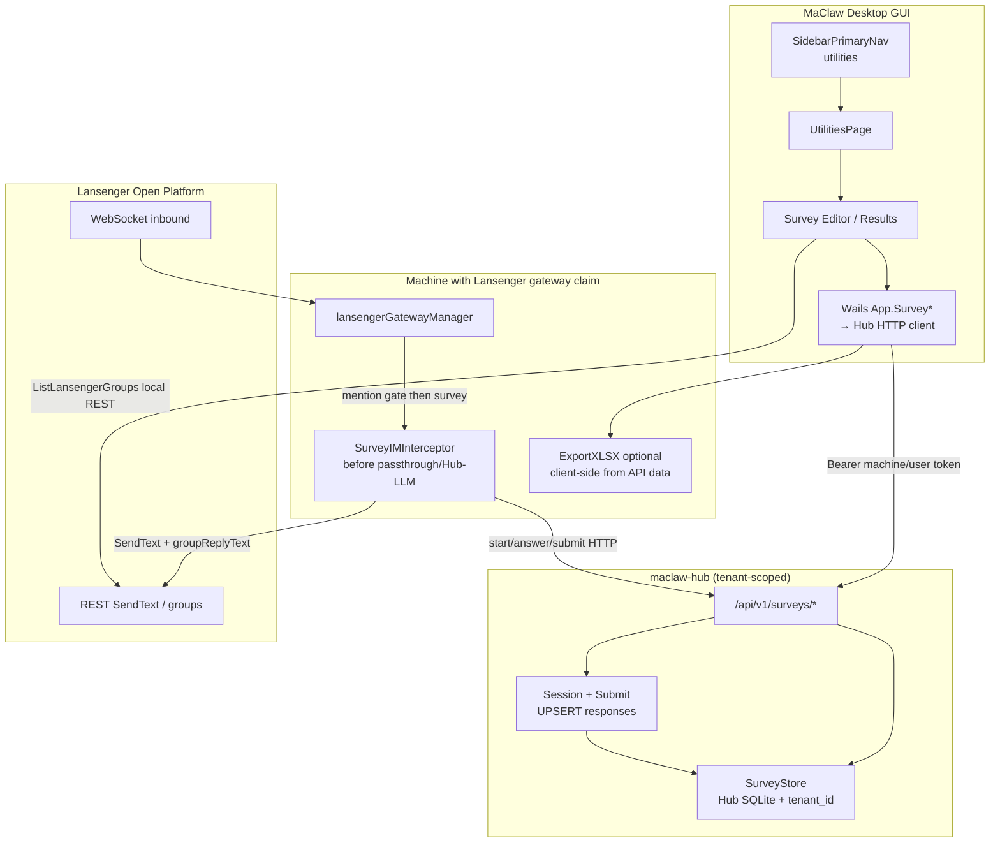
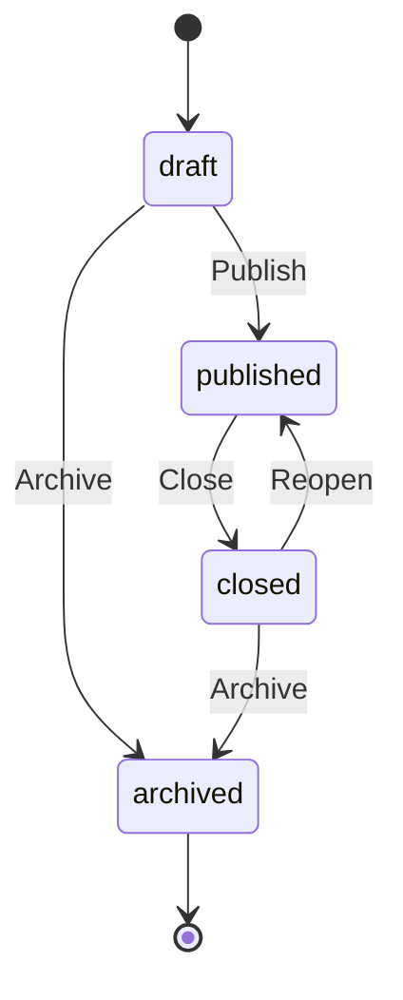
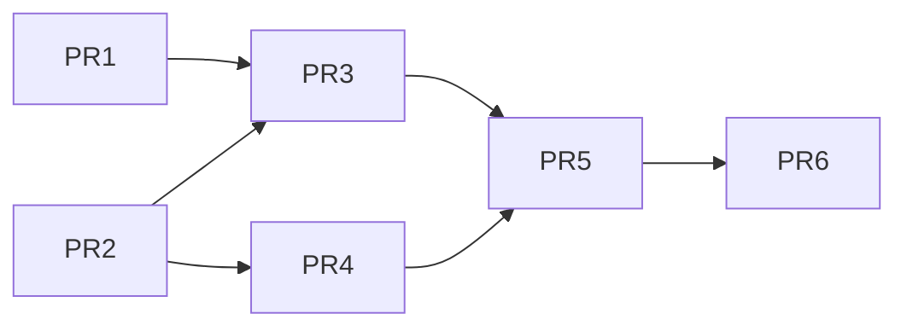

# 实用工具 · 调查问卷（IM 群绑定）系统设计

| 字段 | 值 |
|------|-----|
| **Document** | Utilities / Survey Design |
| **Author** | TBD |
| **Date** | 2026-07-16 |
| **Status** | **Implemented MVP + polish** (rev 4 Hub-first；工程验收 2026-07-16) |
| **Primary surfaces** | Hub (`hub/`) + MaClaw Desktop GUI (`gui/`) + Lansenger bot (`corelib/lansenger`) |
| **Related packages** | `hub/internal/httpapi`, `gui/lansenger_gateway.go`, `gui/frontend/.../SidebarNavRailPieces.tsx`, `corelib/excel` |

---

## Overview

产品已支持蓝信（Lansenger）机器人入群，并可通过 `ListLansengerGroups` 查询机器人已加入的群。本需求要在主界面左侧导航「工作流」下方新增 **「实用工具」** 容器页，首个工具为 **「调查问卷」**：用户在桌面端创建问卷，绑定到已入群的 IM 群（**MVP 仅蓝信**），群成员通过机器人完成投票/填写，创建者在客户端查看结果并导出 Excel。

本设计采用 **Hub 中心化（Hub-first）** 架构（产品决议）：

| 层 | 职责 |
|----|------|
| **Hub** | 问卷定义、绑定、会话、答卷、统计的 **唯一权威存储**（租户隔离）；REST API |
| **MaClaw 桌面** | 管理 UI（实用工具页）；Wails 薄封装调用 Hub；**持有 gateway claim 的机器**做 IM 拦截与出站回复 |
| **蓝信** | 群消息入站 / 文本出站；**不做**交互卡片 MVP |

答题交互：斜杠命令 + 会话式逐步答题（与 `WorkflowInitiationHandler`、passthrough slash 模式一致）。本仓当前 `SendText`/`SendMedia` 无卡片实现；开放平台 appCard 另排期。

**领域契约仍冻结**（rev 3 起）：UNIQUE/UPSERT、HMAC salt、session vs response、short_code、答案编码、拦截决策表、published 绑定不变量、无「开始」intro、导出列、kill-switch、MVP 仅蓝信、**不联动工作流/审批**、**匿名设计时决定默认 false**。  
**rev 4 变更的是数据平面：存 Hub，不存本机 surveys.db。**

---

## Background & Motivation

### 当前状态

| 能力 | 现状 | 关键路径 |
|------|------|----------|
| 左侧主导航 | AI 助手 / Apps（可选）/ 工作流 | `SidebarPrimaryNav` in `gui/frontend/src/components/layout/SidebarNavRailPieces.tsx` |
| 工作流页 | 模板卡片网格 | `gui/frontend/src/components/pages/WorkflowsPage.tsx`，`App.tsx` 中 `navTab === 'workflows'` |
| 顶栏标题 | `mainTopHeaderTitle.ts` 按 navTab 映射 | 新增 `utilities` 时需补分支 |
| 蓝信入群与群列表 | 已实现；REST 可在无 WS 时拉群列表 | `App.ListLansengerGroups` → `gw.ListJoinedGroups` → `/v2/groups/fetch` + `/v2/groups/{id}/info/fetch`（上限 `maxJoinedGroupsListed=300`） |
| 群消息入站 | `ChatType` = `p2p`\|`group`，`GroupID`，`IsAtMe`，`MentionedBots`，`SenderName`，`GroupName` | `corelib/lansenger.IncomingMessage` |
| 群消息门槛 | **必须 @ 机器人** 才会进入处理链 | `lansengerGroupMessageMentionsBot`（`IsAtMe` + bot id 候选；**不信任**自由文本 @） |
| 出站消息 | 文本 `formatText`、媒体；群回复目标用 `lansengerReplyTarget` + `IsGroup` | `Gateway.SendText` / `SendMedia`；`groupReplyText` 做群内归因前缀 |
| 本地 slash 旁路 | `/help`、`/run`、`/runctl`… 匹配 **原始** `msg.Text` | `isPassthroughSlashText` + `TryHandlePassthroughSlashCommandWithSource` |
| 会话式表单采集 | 工作流 IM 发起 | `gui/im_message_handler_workflow_initiate.go` |
| Excel 写入 | 多 sheet：`WriteData.Sheets []WriteSheet` | `corelib/excel.WriteFile`（GoExcel） |
| 本地 SQLite 模式 | 审计/群讨论 DB 在 **data 根目录** 下单文件 | `GetDataDir()/group_discussion_history.db`、`GetDataDir()/im_audit.db`（`modernc.org/sqlite` + WAL + `MaxOpenConns(1)`）；**无** `schema_version` 表，用 ad-hoc `migrate*` |
| 文件导出 UX | `runtime.SaveFileDialog`；`ShowItemInFolder` / `OpenFileOrShowInFolder` | `gui/app.go`（**无** `RevealInExplorer` API） |
| 前端事件 | 安全路径 `a.emitEvent`（裸 `runtime.EventsEmit` 在非生命周期 ctx 上可 `log.Fatal`） | `gui/app.go` |

### 痛点

1. 无法在产品内结构化地向 IM 群成员发起投票/问卷并汇总结果。
2. 工作流表单面向「发起流程」，不是「群内多成员答题 + 统计导出」。
3. 结果需要二次加工时缺少一键 Excel 导出。

---

## Goals & Non-Goals

### Goals

1. **IA**：左侧「工作流」下方新增「实用工具」入口；容器页以工具卡片扩展，首工具为「调查问卷」。
2. **问卷 CRUD**：草稿 / 发布 / 关闭 / 归档；MVP 题型覆盖投票与简单填写。
3. **IM 绑定（MVP）**：问卷绑定一个或多个 **蓝信** 已入群群；schema 预留 `platform` 字段，但 UI/采集仅 `lansenger`。
4. **填写路径**：群成员通过 @机器人 + 命令/会话完成答题；**始终一人一答一行**（可 `allow_update` 覆盖）；**是否匿名在问卷设计时设定，默认不匿名**（发布后不可改）。
5. **结果**：实时汇总、答卷明细、选择题条形占比；导出 `.xlsx`。
6. **权限（MVP）**：仅本机 MaClaw 用户可创建/管理/看结果；群成员仅能提交答卷；**不提供**群内查结果命令。
7. **可扩展**：后续工具可挂同一容器；后续平台需各 gateway 显式接入同一 `SurveyIM.TryHandle` 后再打开 UI。

### Non-Goals（MVP 不做 / 明确不做）

- Hub 多租户中心化问卷服务、跨设备实时同步问卷库。（数据归属另议；**与工作流无关**）
- 蓝信交互卡片 / 按钮回调（本仓当前降级为编号文本；开放平台另有 appCard 能力待 spike）。
- 复杂问卷逻辑（跳题、矩阵题、文件上传题、配额控制）。
- 公开互联网 Web 表单托管。
- 移动端独立问卷管理 UI。
- 将问卷结果自动写入 datasrv / MIS。
- **QQ / 微信 / Telegram 问卷采集**（schema 可有 platform 列，但不接线、UI 不暴露）。
- 允许多次独立答卷行（`one_response_per_user=false` 多行历史）—— MVP 不实现。
- **与工作流 / 审批联动**（发起流程、审批节点、结果回写 workflow instance 等）—— **产品明确不做**；问卷是独立「实用工具」，与「工作流」仅共享左侧导航邻接，无数据/运行时耦合。

---

## Proposed Design

### 1. 信息架构（IA）

```
左侧导航 (SidebarPrimaryNav)
├── AI 助手          switchTool('ai')
├── Apps（可选）     switchTool('apps')
├── 工作流           switchTool('workflows')   // showWorkflowEntry
└── 实用工具（新）   switchTool('utilities')   // showUtilitiesEntry，默认 true
        │
        └── UtilitiesPage（容器）
              ├── 工具卡片：调查问卷 → SurveyTool routes
              └── （预留）其他工具卡片
```

**前端改动点（对齐现有模式）：**

| 位置 | 变更 |
|------|------|
| `SidebarNavRailPieces.tsx` `SidebarPrimaryNav` | 在 workflows 块后增加 utilities 项；props 增 `showUtilitiesEntry`、`utilitiesLabel` |
| `SidebarNavRail.tsx` / `AppSidebarShell.tsx` | 透传 props |
| `App.tsx` | `navTab === 'utilities'` 渲染 `<UtilitiesPage />`；`show_utilities_entry`（默认 true） |
| `mainTopHeaderTitle.ts` | 增加 `utilities` 标题映射（中/英） |
| 新页面 | `gui/frontend/src/components/pages/UtilitiesPage.tsx` + CSS |
| 子路由/视图状态 | 页内 state：`home` \| `survey-list` \| `survey-edit` \| `survey-results`（不引入 react-router） |

**UtilitiesPage 布局（参考 WorkflowsPage 卡片网格）：**

- Header：标题「实用工具」+ 简短说明
- Body：工具卡片网格（icon / 标题 / 描述 / 进入）
- 进入「调查问卷」后切换到 Survey 子界面（列表 → 编辑器 / 结果）

### 2. 端到端架构（Hub-first）



**分流原则（仍强制）：**

1. 群消息进入 `onIncomingMessage` 后：mention gate → **survey 拦截** → 再 passthrough / local agent / `forwardToHub`（LLM）。
2. 拦截命中后：**只调 Hub Survey API** 推进会话/提交，**绝不**把问卷消息当普通 agent 任务转 Hub LLM。
3. 管理 UI 任意已登录 Hub 的 MaClaw 均可 CRUD/看结果；**答题链路**依赖「当前持有蓝信 gateway claim 且 WS 在线」的机器。

### 3. 数据归属决策（Local vs Hub）— **rev 4 产品决议**

| 方案 | 说明 | 结论 |
|------|------|------|
| A. 本地 SQLite | 问卷在跑机器人的那台机器 | **否决（MVP）** |
| **B. Hub 中心存储** | 定义/会话/答卷在 Hub，租户隔离；桌面为客户端 | **采用** |
| C. datasrv 结构化表 | 不适合会话状态与 IM 拦截 | 不采用 |

**存储位置：** Hub 主库（与现有 tenant-scoped store 一致），表带 `tenant_id`；`short_code` 在 **租户内** UNIQUE。

**理由（产品）：**

1. 企业场景：换机器、多管理员可看同一问卷与结果。
2. 与「不联动工作流」兼容：独立 survey 服务，仅共享 Hub 租户与鉴权。
3. 蓝信 gateway 仍在桌面：采集节点 ≠ 存储节点；存储上 Hub 不要求每台机器都跑机器人。

**约束（UI 明示）：**

- **管理问卷**需要 Hub 已连接 / 已登录；未连接时列表展示空态 + 引导注册/连接 Hub。
- **列表群**仍走本机 `ListLansengerGroups`（REST，可不依赖 WS）。
- **收答复题**需要：本机（或租户内某机）Lansenger WS **已连接** 且持有 gateway claim；否则群内无回复。
- 存在 `published` 问卷且本机 gateway 非 connected 时显示 **banner**（「群内答题不可用，请启动蓝信机器人」）。
- 导出：客户端拉 Hub 明细后本地写 xlsx（`corelib/excel`），或 Hub 生成文件流二选一；**MVP：客户端生成**。

### 4. 模块划分

```
hub/
  internal/survey/           # 领域 store + runtime（或 store/sqlite survey_repo）
    models.go
    store.go                 # tenant-scoped CRUD / UNIQUE / salt
    runtime.go               # session + submit UPSERT
  internal/httpapi/
    survey_handlers.go       # /api/v1/surveys/*
    router.go                # 注册路由 + 鉴权中间件

gui/
  survey_hub_client.go       # HTTP 客户端封装（getHubCredentials 模式）
  survey_wails.go            # App.Survey* → hub client
  survey_im_interceptor.go   # 决策表；调用 hub client 而非本地 store
  survey_export.go           # 拉 responses → corelib/excel
  lansenger_gateway.go       # onIncomingMessage 接入

gui/frontend/src/components/
  pages/UtilitiesPage.tsx
  pages/utilities/survey/*
```

共享 DTO 可放 `hub` 响应 JSON 与前端 `types.ts` 对齐；MVP 不强制抽 `corelib/survey`。

### 5. 问卷领域模型

#### 5.1 生命周期（冻结）



| 状态 | 可编辑题目 | 可绑定群 | 可答题 | 可导出 | 可删除 |
|------|------------|----------|--------|--------|--------|
| `draft` | 是 | 是（可增可减，可为 0） | 否 | 否 | 是（级联） |
| `published` | **否** | **可增绑**；解绑见下（**禁止解到 0**） | 是 | 是 | 否（先 Close） |
| `closed` | 否 | **否**（不可增绑、不可解绑） | 否 | 是 | 否（先 Archive 或仅 Archive 后删） |
| `archived` | 否 | 否 | 否 | 是（只读） | 是（级联） |

**Publish 前置条件（MVP 冻结）：**

1. 至少 1 道题。
2. **至少 1 个 binding**（`platform=lansenger` + 非空 `group_id`）。零绑定拒绝发布，错误文案：`请先绑定至少一个蓝信群`。
3. `short_code` 已在 **CreateSurvey** 时分配（列 `NOT NULL`；冲突重试见 §5.4）。
4. `settings_json` 内已有 `anonymity_salt`（创建时生成，永不轮换；见 §5.5 字节级 HMAC 定义）。
5. 状态 → `published`，写 `published_at`。
6. 可选 `opts.Announce`：向绑定群发公告（失败不回滚发布，返回 `AnnounceResult.Failures`）。

**绑定变更不变量（MVP 冻结，Policy A）：**

| API / 操作 | `draft` | `published` | `closed` | `archived` |
|------------|---------|-------------|----------|------------|
| 增绑 `BindSurveyGroups` | 允许 | **允许** | **拒绝**（与上表「可绑定群=否」一致） | 拒绝 |
| 解绑 `UnbindSurveyGroup` | 允许（可至 0） | 允许，但若解绑后 binding 数将为 **0** → **拒绝**，错误：`已发布问卷至少保留一个群绑定` | **拒绝** | 拒绝 |

- 不采用「最后一群解绑自动 Close」——管理员必须显式 Close。
- `closed` / `archived` 绑定只读，避免关闭后静默改可达群。

**Reopen（`closed → published`）：**

- **保留**同一 `id`、`short_code`、题目、bindings、**全部已提交 responses**。
- Reopen 时若 bindings 已为 0（历史脏数据），**拒绝 reopen**，要求先回到可编辑态修数据或新建；正常路径 closed 不可解绑故 bindings ≥1。
- 不自动清会话；新答卷仍受 UNIQUE 约束（已提交用户需 `allow_update` 才能改）。
- 不强制再 announce；UI 可二次调用 `AnnounceSurveyToBoundGroups`。

**DeleteSurvey：**

- 仅 `draft` 或 `archived`。
- **级联删除** `survey_questions`、`survey_bindings`、`survey_responses`、相关 `survey_sessions`（`WHERE survey_id=?`）。

**Deadline（MVP 冻结）：**

- 仅在 **submit 时**（含快投一步提交）检查 `settings.deadline`（UTC ISO）；超时拒绝，文案：`问卷已截止`。
- **不**跑进程内定时器自动 Close；`status` 仍为 published 直至管理员 Close。逾期仅拒绝新提交。

**完成率（结果 UI）：**

- 若 `settings.target_count > 0`：`response_count / target_count`。
- 否则 **只显示** `response_count`。
- `GroupInfo.TotalMembers` 可单独展示为「参考群人数」，**禁止**作为完成率分母且不标注。

#### 5.2 题型与答案编码（冻结）

**MVP 题型**

| type | IM 输入（解析后） | **存储** `answers_json[question_id]` | 校验失败重问 |
|------|-------------------|--------------------------------------|--------------|
| `single_choice` | 1-based 序号 **或** option id **或** label（大小写不敏感） | **string**：option `id` | 空 / 无法映射到唯一 option |
| `multi_choice` | `1,3` / `1 3` / `A C` / id 列表 | **sorted `[]string`**：option ids，去重后按 **id 字典序** 升序（仅稳定 JSON / 比较） | 空（若 required）/ 任一 token 无法映射 / 非法分隔 |
| `text` | 自由文本 | **string**（`strings.TrimSpace`） | required 且空；长度 > `max_length`（默认 500） |
| `rating` | 整数 | **int**，落在 `[min,max]`（默认 1–5） | 非整数 / 越界 |

**解析规则：**

1. 输入阶段可接受序号、id、label；**入库前一律 normalize 到 option id**（choice）或 int/string。
2. 选项在发布后冻结；`config_json.options[]` 顺序即 **展示 position**（0-based 编辑器顺序），发布后不可重排。
3. 多选 **存储**：ids 去重后按 id 字符串排序序列化（集合相等可字节比较）。
4. 多选 **展示 / 导出 / 统计条**：**不得**按 id 字典序排 label。应将选中 ids 映射为 label 后，按 **`options` 数组中的顺序（position）** 输出；未选中的 option 不出现在 multi 单元格中。summary sheet 的 option 行同样按 options 数组顺序，而非 id sort。
5. `answers_json` 示例：

```json
{
  "q_uuid_1": "opt_yes",
  "q_uuid_2": ["opt_a", "opt_c"],
  "q_uuid_3": "希望周五",
  "q_uuid_4": 4
}
```

**快投：** 仅当问卷 **恰好 1 题** 且类型为 `single_choice` 或 `rating` 时，`/survey <code> <token>` 一步提交；多题忽略尾部 token 并进入会话。

#### 5.3 绑定（MVP 范围）

```go
type IMPlatform string // MVP 运行时仅允许 "lansenger"

type SurveyGroupBinding struct {
    Platform  IMPlatform `json:"platform"`  // must be "lansenger" in MVP
    GroupID   string     `json:"group_id"`
    GroupName string     `json:"group_name"` // 绑定时刻快照
    BoundAt   time.Time  `json:"bound_at"`
}
```

- UI **硬编码** platform=`lansenger`，不展示平台选择器。
- `BindSurveyGroups` 服务端拒绝非 `lansenger`。
- 群列表：`ListLansengerGroups()`。
- 一问卷多群；一群多问卷（靠 short_code 区分）。

**多平台扩展点（非 MVP，文档化 only）：**

```go
// 各 gateway 在 mention/相应门槛之后、agent/Hub 之前调用：
type SurveyIncoming struct {
    Platform  string // "lansenger" | "qqbot" | ...
    UserID    string
    UserName  string // prefer platform display name
    ChatType  string // "p2p" | "group"
    GroupID   string
    Text      string // raw text before strip
    IsAtMe    bool
    MentionedBotNames []string
}
func (s *SurveyIM) TryHandle(in SurveyIncoming) (reply string, handled bool)
```

Telegram chat id、QQ 多为 C2C 等语义差异由各 gateway 适配后再启用 UI。

#### 5.4 短码 short_code（冻结）

| 规则 | 值 |
|------|-----|
| 长度 | **固定 6** |
| 字母表 | Crockford base32：`0123456789ABCDEFGHJKMNPQRSTVWXYZ`（无 I,L,O,U） |
| 生成 | 加密随机 → 映射字母表；**本地 DB `UNIQUE`**；冲突最多重试 **8** 次后报错 |
| 输入 | 大小写不敏感；用户输入的 `i/l/o/u` 可映射到近似字或直接拒绝（MVP：**拒绝非法字符**并提示合法字母表） |
| 示例 | `A3F9K2`（非 `Q7K2`） |
| 分配时机 | **CreateSurvey 时必须分配**（`short_code NOT NULL`）；Reopen **不变** |
| 命名空间 | **Hub 租户内** UNIQUE（`tenant_id + short_code`） |

#### 5.5 匿名与 respondent_key（冻结）

**产品规则：**

- **是否匿名由问卷设计时决定**（创建/编辑草稿时的 settings 开关）。
- **默认不匿名**：`Anonymous = false`。
- **Publish 后不可改** `anonymous`（与题目锁定一致）；要改只能 DuplicateSurvey。

| 模式 | `respondent_key` | `respondent_name` 存储 |
|------|------------------|------------------------|
| `anonymous=false`（默认） | 原始 `staffId`（`FromUserID`） | `msg.SenderName`（空则 `""`） |
| `anonymous=true` | 见下方 **HMAC 算法**（小写 hex） | **始终 `""`**（界面显示「匿名用户」） |

**HMAC 密钥材料与算法（字节级冻结，PR2 单测 oracle）：**

```
// CreateSurvey:
rawSalt := make([]byte, 32)
crypto/rand.Read(rawSalt)  // 必须成功读满 32 字节
settings.anonymity_salt = base64.StdEncoding.EncodeToString(rawSalt)  // 仅存储形态

// ComputeRespondentKey(anonymous=true, staffId):
key, err := base64.StdEncoding.DecodeString(settings.anonymity_salt)
// err != nil || len(key) != 32  → 视为数据损坏，拒绝提交/启动并 log；LoadSurvey 可自检
mac := hmac.New(sha256.New, key)           // key = 解码后的 32 raw bytes，不是 base64 字符串本身
mac.Write([]byte(staffId))                 // message = UTF-8 staffId
respondent_key = hex.EncodeToString(mac.Sum(nil))  // 64 字符小写 hex
```

**明确拒绝的错误实现：** 用 base64 ASCII 当 HMAC key；用 hex(salt) 当 key；对 salt 做双重 encode。

- 盐 **永不导出**、Wails `GetSurvey` **redact** `anonymity_salt`（字段省略或空）。
- 匿名模式下防重复仍依赖 `respondent_key` UNIQUE。
- 导出：列保留；`respondent_key` 填字面量 `anonymous`，`respondent_name` 空（见 §8）——**不**导出 HMAC hex。

#### 5.6 Session vs Response 源真相（冻结）

| 实体 | 职责 | 何时创建 | 何时销毁 |
|------|------|----------|----------|
| **`survey_sessions`** | **仅**临时游标：当前 `survey_id`、`cursor`（下一题 index）、进行中 `answers_json`、过期时间 | 用户成功开始问卷（通过校验 code+binding） | 最终 submit 成功后删除；`取消`；TTL 到期清理 |
| **`survey_responses`** | **已提交答卷** 唯一持久化 | **仅在全部题目校验通过并最终提交时** INSERT/UPSERT | 管理员 Delete 级联；用户不可删 |

**硬性规则：**

1. **不**创建 `in_progress` 的 response 行。
2. `ListSurveyResponses` / `GetSurveyStats` / 导出 **只** 读 `survey_responses`（全部为 submitted）。
3. 会话 `answers_json` 丢了只影响未提交进度，不影响统计。
4. Session TTL：**30 分钟**无活动（每次合法答题刷新 `expires_at`）。清理：submit 路径顺带删过期；PR4/PR6 可加启动时 `DELETE FROM survey_sessions WHERE expires_at < now`。
5. **单用户单平台仅一个活跃 session**（`session_key = platform + ":" + userID`）。开始另一 `code` 时：若已有未过期 session 且 survey 不同 → 回复 `您正在填写《旧标题》。回复「取消」结束后再开始新问卷`（**不**静默覆盖）。同 code 则恢复。

---

### 6. 答题者流程（Respondent Flow）

#### 6.1 能力边界（蓝信）

| 能力 | 支持情况 |
|------|----------|
| 群文本收发 | 是 |
| 群列表 REST | 是（可无 WS） |
| 答题收消息 | **需要 WS 已连接** |
| 群内 @ 门槛 | **是** |
| 交互卡片 | **否** |
| 私聊 | 是（`allow_p2p`） |

#### 6.2 推荐交互（MVP）

**命令（需 @ 机器人，群内）：**

```
@机器人 /survey <code>
@机器人 /survey <code> <answer>     # 单题快投
@机器人 问卷 <code>
@机器人 调查 <code>
@机器人 /survey list
@机器人 /survey cancel
@机器人 /survey status
@机器人 /survey help
```

中文启动 **必须** 带 code token：`问卷 <code>` / `调查 <code>`；裸「问卷」「调查」**不**匹配（避免 `@Bot 问卷写好了吗` 误触）。

**会话内控制语**（已有活跃 session，且 strip 后**精确**匹配）：

| 控制语 | 生效 phase | 行为 |
|--------|------------|------|
| `取消` | 任一 | 删除 session |
| `上一题` | `answering` 且 cursor>0 | cursor--，重发该题（已答内容可保留在 answers 中供回改） |
| `修改` | **仅** `confirm_update` | 清空 answers，`phase=answering`，cursor=0，发 Q1 |
| ~~`开始`~~ | — | **MVP 不使用**（无 intro 步；见下） |

**开始路径（Policy A，与序列图一致）：** `/survey <code>`（及中文等价）在校验通过后 **立即** 创建 `phase=answering` 的 session 并发送 **第 1 题**；**没有**「回复开始继续」中间态。公告与帮助文案不得要求用户再发「开始」。

**公告模板示例：**

```
📋 《团建意向调查》
短码：A3F9K2 · 共 3 题
规则：每人限答 1 次 · 非匿名
请在本群 @我 并发送：/survey A3F9K2
（发送后将直接开始第 1 题）
```

**私聊：** `allow_p2p=true` 时 p2p 可 `/survey <code>`；群公告仍发在群。p2p 时 `group_id` 存 `""`，绑定校验改为：用户曾从绑定群获知 code **或** 仅校验 code 存在且 published（MVP：**p2p 只校验 code+published+allow_p2p**，不强制 group 绑定——管理员知悉短码外泄风险；群内仍强制 binding）。

#### 6.3 拦截决策表（冻结）

**接入顺序**（`onIncomingMessage`）：

1. 现有 **mention gate**（群且未 @ → return）
2. **`survey_enabled` kill-switch**：若 false，**完全跳过** survey 拦截（消息继续 passthrough / local / hub，**不**自动回复「已关闭」——避免与普通对话抢话；桌面 UI 仍可管理问卷）
3. `SurveyIM.TryHandle`（见下表）
4. `isPassthroughSlashText`（**原始** `msg.Text`，与今日一致——survey strip **不得**改写传入 passthrough 的原文）
5. local / hub / forwardToHub

**Mention strip 算法**（仅用于 survey 解析，不修改存入审计的原文）：

```
func stripBotMentions(text string, botNames []string) string:
  t = strings.TrimSpace(text)
  // 1) For each name in MentionedBots[].Name (and optional configured bot display name):
  //    remove case-insensitive tokens "@"+name and name with optional surrounding spaces
  // 2) While t matches leading `@\S+` (Unicode letter/digit/_-), strip that token + following spaces
  // 3) TrimSpace
  return t
```

注意：`corelib/textutil` **无** mention strip；实现放在 `survey_im_interceptor.go`。

**`TryHandle` 决策（按行号优先级，先匹配先生效）：**

| # | 条件 | handled | 行为 |
|---|------|---------|------|
| 1 | strip 后匹配 `/survey help` 或 `问卷帮助` | true | 帮助文案 |
| 2 | strip 后匹配 `/survey list` | true | 列出 **本群** `published` 且 binding 含本 `group_id` 的 code+标题（p2p：空列表或提示去群内 list） |
| 3 | strip 后匹配 `/survey cancel` **或**（有 session 且精确 `取消`） | true | 删 session，确认已取消（**任意 phase**） |
| 4 | strip 后匹配 `/survey status` | true | 见模板 §6.4 |
| 5 | strip 后匹配启动命令 `/survey CODE` / `问卷 CODE` / `调查 CODE` [+ optional answer] | true | start/fast-path（校验 published、deadline、binding、session 冲突）；成功则 **直接发 Q1** 或一步提交；`allow_update` 已提交见 #5b |
| 5b | 启动命令命中且已有 submitted 且 `allow_update` | true | **不**进入 answering；写/更新 session `phase=confirm_update`，回复固定提示：`您已提交。回复「修改」可重新作答，或「取消」退出`（**不**解析 optional answer 为答题） |
| 5c | 启动命令命中且已有 submitted 且 `!allow_update` | true | 拒绝文案；**不**建 session |
| 6a | 未过期 session 且 **`phase=confirm_update`** 且精确 `修改` | true | 清空 `answers_json`，`phase=answering`，`cursor=0`，发送 Q1 |
| 6b | 未过期 session 且 **`phase=confirm_update`** 且精确 `取消` | true | 同 #3（删 session） |
| 6c | 未过期 session 且 **`phase=confirm_update`** 且其他任意文本（含 `2`、闲聊、题号） | true | **不**解析为答案；重发固定提示：`您已提交。回复「修改」可重新作答，或「取消」退出` |
| 7 | 未过期 session 且 **`phase=answering`** 且精确 `上一题` | true | 见控制语表 |
| 8 | 未过期 session 且 **`phase=answering`** 且文本可解析为当前 cursor 题的答案（合法或非法） | true | 合法则推进/提交；非法则重问（仍 handled） |
| 9 | 未过期 session 且 **`phase=answering`** 且无法解析为控制语/答案（闲聊） | true | `您正在填写问卷《{title}》。请回答当前题目，或发送「取消」结束后再与助手对话。`（短路，不进 LLM） |
| 10 | 其他 | false | 不拦截 |

**注意：** 仅 `phase=answering` 走 #7–#9 答题逻辑。`confirm_update` 下数字答案（如 `2`）**绝不**写入 answers。

**拒绝类 IM 文案（中文 MVP，英文 i18n 键预留）：**

| 场景 | 文案 |
|------|------|
| code 不存在 | `未找到问卷短码，请核对后重试` |
| 非 published | `该问卷未开放填写` |
| 群未绑定 | `该问卷未绑定本群，无法在此填写` |
| 已提交且 !allow_update | `您已提交过该问卷，感谢参与` |
| 已提交且 allow_update | `您已提交。回复「修改」可重新作答，或「取消」退出` |
| deadline | `问卷已截止` |
| UNIQUE/并发冲突 | `提交冲突，请稍后重试` |
| SendText 失败 | 见 §6.5（用户侧尽量再发错误提示；失败则 log） |

**回复发送：** 使用 `lansengerReplyTarget(msg)` + `IsGroup`；正文经 `groupReplyText` / `MaybeFormatGroupReplyWithQuote` 与现网群归因一致。`respondent_name` 优先 `msg.SenderName`。

#### 6.4 allow_update 与 status（冻结）

- **`allow_update=false`（默认）：** 决策表 #5c，启动命令直接拒绝。
- **`allow_update=true`：** 决策表 #5b → `phase=confirm_update`；仅 #6a `修改` 进入 `answering` 并发 Q1；最终 submit **UPSERT** 同一 `(survey_id, platform, respondent_key)`。
- **status 在 `confirm_update`：** `已提交《{title}》。待确认是否修改：回复「修改」或「取消」`。
- **`/survey status`：**  
  - 无答卷无会话：`您尚未填写《{title}》`（若带 code）或 `当前无进行中的问卷会话`  
  - `phase=answering`：`正在填写《{title}》第 {n}/{total} 题`  
  - `phase=confirm_update`：见上  
  - 已提交且无 session：`已于 {submitted_at} 提交《{title}》`

**`/survey list` 隐私：** 仅当前群已绑定且 published 的标题+短码；不暴露其他群问卷、不暴露回收数。

#### 6.5 Runtime operational constraints

| 主题 | 规则 |
|------|------|
| Store 并发 | `modernc.org/sqlite`，`SetMaxOpenConns(1)`，`SurveyStore` 方法级 `sync.Mutex`（对齐 discussion store） |
| SendText 失败 | 重试 **1** 次（token 过期路径可走 gateway 已有 refresh）；仍失败：`log.Printf` + 若可能再发短消息 `发送失败，请稍后重试`；Announce 聚合到 `Failures[]` |
| Gateway 断开 | UI banner：`蓝信未连接，已发布问卷无法在群内收集答卷`（当 `CountPublished()>0 && !connected`） |
| REST vs WS | 绑定选群可用 REST；答题依赖 WS |
| kill-switch | AppConfig `survey_enabled` 默认 `true`；false 时不拦截 IM（见决策表 #2） |
| Hub 模式 | TryHandle 成功则 **禁止** `forwardToHub`；PR4 必测 |

```mermaid
sequenceDiagram
  participant U as Group member
  participant LX as Lansenger
  participant GW as lansengerGatewayManager
  participant S as SurveyIMInterceptor
  participant DB as SurveyStore

  U->>LX: @Bot /survey A3F9K2
  LX->>GW: IncomingMessage group+IsAtMe
  GW->>S: TryHandle after mention gate
  S->>DB: Resolve code + binding
  S->>DB: Upsert session only
  S-->>GW: prompt Q1
  GW->>LX: SendText groupReplyText
  LX->>U: 第 1 题...

  U->>LX: @Bot 2
  LX->>GW: IncomingMessage
  GW->>S: active session parse answer
  S->>DB: session answers; on last Q INSERT response
  S-->>GW: 完成致谢
```

#### 6.6 非采用路径

| 路径 | 评价 |
|------|------|
| 纯 Web 链接 | 无稳定公网 | 二期 |
| 无 @ 监听 | 破坏 mention gate | 拒绝 |
| 交互卡片 | 未实现 | 二期 spike |
| **仅在 `handleLocalMessage` 拦截** | Hub 的 `forwardToHub` 会跳过，答卷进 LLM | **拒绝** |

---

### 7. 结果 UI

1. **概览**：状态、绑定群、deadline、`response_count`、可选 `target_count` 完成率、参考群人数（标注）。
2. **按题统计**：choice 计数+百分比条；rating 均值；text 可搜索列表。
3. **明细表**：仅 submitted；匿名隐藏姓名。
4. **导出**：`ExportSurveyXLSX` → 优先 `runtime.SaveFileDialog`（默认名 `survey_{code}_{yyyyMMdd_HHmmss}.xlsx`）；取消则写 `GetDataDir()/exports/` 并用 **`ShowItemInFolder`** 打开所在目录。

**实时性：** 提交成功后 `a.emitEvent("survey-updated", map[string]any{"survey_id": id})`；前端 `EventsOn("survey-updated", …)`。若仓库有 `constants/events.ts` 则登记同名常量。

---

### 8. 导出 Excel（冻结列）

使用 `corelib/excel.WriteFile` 与 `WriteData{Sheets: [...]}` **两 sheet**：

**Sheet `responses`（列顺序固定）**

| 列 | 内容 |
|----|------|
| `response_id` | uuid |
| `submitted_at` | RFC3339 |
| `platform` | e.g. lansenger |
| `group_id` | 提交时所在群 |
| `group_name` | 冗余快照（若有） |
| `respondent_key` | 非匿名：staffId；匿名：字面量 `anonymous`（**不**导出 HMAC） |
| `respondent_name` | 非匿名：姓名；匿名：空 |
| 随后每题一列 | 表头：`Q{position}: {title}`（position 从 1）；单元格：single=**label**；multi=选中项 labels 用 `, ` 连接，顺序=**`options` 数组 position**（非 id 字典序）；text=原文；rating=十进制数字 |

题目列顺序 = `survey_questions.position` ASC。

**Sheet `summary`**

| 列 | 内容 |
|----|------|
| `question_id` | |
| `position` | |
| `question_title` | |
| `option_id` / 空 | rating/text 行可空 |
| `option_label` / 桶 | choice 行按 **options 数组顺序** 输出每一 option（含 count=0） |
| `count` | |
| `percent` | **`count / submitted_response_count`**（分母=提交人数，非「选项勾选总次数」；multi_choice 下各 option 百分比之和可 >100%） |

匿名策略（冻结一种）：**保留列**，`respondent_key=anonymous`，`respondent_name=""`。

---

### 9. 权限与隐私

| 角色 | 能力 |
|------|------|
| 已登录 Hub、属该租户的桌面用户 | CRUD/发布/结果/导出/绑定（经 Hub API） |
| 持 gateway 的机器 | 调用 `im/handle` 推进答题；出站 SendText |
| 群成员 | 仅提交；**无** `/survey result` |
| 跨租户 | 隔离；不可见 |

**SurveySettings（冻结字段）：**

```go
type SurveySettings struct {
    Anonymous          bool       `json:"anonymous"`           // default false；问卷设计时决定
    AllowUpdate        bool       `json:"allow_update"`        // default false
    AllowP2P           bool       `json:"allow_p2p"`           // default false
    Deadline           *time.Time `json:"deadline,omitempty"`
    TargetCount        int        `json:"target_count"`        // 0 = 不展示完成率
    AnonymitySalt      string     `json:"anonymity_salt"`      // server-only; redact in API；Create 时始终生成，仅 anonymous=true 时用于 key
}
// 注意：MVP 删除 OneResponsePerUser 开关；DB 层始终一人一行。
// 匿名策略：设计时（draft）可改 Anonymous；Publish 后锁定，与题目同样不可变（改法=DuplicateSurvey）。
```

**安全：**

- 6 位 Crockford + 群绑定 + 发布后可答。
- 不把 AppSecret / anonymity_salt 暴露给前端。
- 导含 PII 本地落盘提示。
- 会话 TTL 30m；每用户简单限流（如 2 msg/s）。

---

## API / Interface Changes

### Hub REST（权威 API，租户从鉴权上下文取）

前缀：`/api/v1/surveys`。鉴权：与现有 machine/user Bearer 一致；**所有查询带 tenant 隔离**。

| Method | Path | 说明 |
|--------|------|------|
| GET | `/api/v1/surveys` | 列表（status/filter） |
| POST | `/api/v1/surveys` | 创建（分配 short_code + salt） |
| GET | `/api/v1/surveys/{id}` | 详情（**redact** anonymity_salt） |
| PATCH | `/api/v1/surveys/{id}` | 更新草稿 |
| DELETE | `/api/v1/surveys/{id}` | draft\|archived 级联删 |
| POST | `/api/v1/surveys/{id}/publish` | ≥1 binding |
| POST | `/api/v1/surveys/{id}/close` | |
| POST | `/api/v1/surveys/{id}/reopen` | 保留 code/答卷 |
| POST | `/api/v1/surveys/{id}/archive` | |
| POST | `/api/v1/surveys/{id}/duplicate` | 新 id/code/salt，draft |
| POST | `/api/v1/surveys/{id}/bindings` | 绑定群 |
| DELETE | `/api/v1/surveys/{id}/bindings/{platform}/{groupId}` | 解绑规则同前 |
| GET | `/api/v1/surveys/{id}/stats` | submitted only |
| GET | `/api/v1/surveys/{id}/responses` | 分页明细 |
| POST | `/api/v1/surveys/im/handle` | **IM 采集专用**：start/answer/cancel/submit 状态机一步（body 含 platform, group_id, staff_id, text…）；返回 `reply_text` |

`POST .../im/handle` 供 gateway 机器调用；须鉴权为同租户 machine token。会话与答卷均在 Hub 上推进。

### Wails `App` 方法（薄代理 → Hub）

```go
// 管理面：转发 Hub REST；未连接 Hub 时返回明确错误
func (a *App) ListSurveys(...) (*SurveyListResult, error)
func (a *App) GetSurvey(id string) (*SurveyDetail, error)
func (a *App) CreateSurvey(input SurveyCreateInput) (*SurveyDetail, error)
// ... Update / Delete / Publish / Close / Reopen / Archive / Duplicate
// ... Bind / Unbind
// ... GetSurveyStats / ListSurveyResponses
func (a *App) ExportSurveyXLSX(id string) (string, error) // Hub 拉数据 + 本地 excel + SaveFileDialog
func (a *App) AnnounceSurveyToBoundGroups(id string) (*SurveyAnnounceResult, error) // 本机 gateway SendText
// ListLansengerGroups 已存在（本机蓝信 REST）
```

### 关键 DTO

```go
type SurveyCreateInput struct {
    Title       string           `json:"title"`
    Description string           `json:"description"`
    Questions   []SurveyQuestion `json:"questions"`
    Settings    SurveySettingsIn `json:"settings"` // no salt from client
}

// SurveySettingsIn: Anonymous, AllowUpdate, AllowP2P, Deadline, TargetCount only.
// Server injects AnonymitySalt on create.

type SurveyQuestion struct {
    ID        string         `json:"id"`
    Type      string         `json:"type"` // single_choice|multi_choice|text|rating
    Title     string         `json:"title"`
    Required  bool           `json:"required"`
    Options   []SurveyOption `json:"options,omitempty"`
    Min       *int           `json:"min,omitempty"`
    Max       *int           `json:"max,omitempty"`
    MaxLength *int           `json:"max_length,omitempty"`
}

type SurveyOption struct {
    ID    string `json:"id"`
    Label string `json:"label"`
}

type SurveyPublishOptions struct {
    Announce bool `json:"announce"`
}
```

### 配置项

| Key | 默认 | 说明 |
|-----|------|------|
| `show_utilities_entry` | `true` | 左侧实用工具入口 |
| `survey_enabled` | `true` | IM 拦截总开关（kill-switch） |

---

## Data Model Changes

### Hub SQLite（租户表；路径随 Hub 主库，**不是**桌面 GetDataDir）

```sql
-- 所有业务表均含 tenant_id；short_code 租户内唯一

CREATE TABLE IF NOT EXISTS surveys (
  id            TEXT PRIMARY KEY,
  tenant_id     TEXT NOT NULL,
  short_code    TEXT NOT NULL,          -- 6 Crockford
  title         TEXT NOT NULL,
  description   TEXT NOT NULL DEFAULT '',
  status        TEXT NOT NULL,          -- draft|published|closed|archived
  settings_json TEXT NOT NULL,          -- includes anonymity_salt, allow_update, ...
  created_by    TEXT NOT NULL DEFAULT '',
  created_at    TEXT NOT NULL,
  updated_at    TEXT NOT NULL,
  UNIQUE (tenant_id, short_code)
  published_at  TEXT NOT NULL DEFAULT '',
  closed_at     TEXT NOT NULL DEFAULT ''
);

CREATE TABLE IF NOT EXISTS survey_questions (
  survey_id   TEXT NOT NULL,
  question_id TEXT NOT NULL,
  position    INTEGER NOT NULL,
  type        TEXT NOT NULL,
  title       TEXT NOT NULL,
  required    INTEGER NOT NULL DEFAULT 1,
  config_json TEXT NOT NULL DEFAULT '{}',
  PRIMARY KEY (survey_id, question_id)
);

CREATE TABLE IF NOT EXISTS survey_bindings (
  survey_id   TEXT NOT NULL,
  platform    TEXT NOT NULL,             -- MVP: only lansenger rows
  group_id    TEXT NOT NULL,
  group_name  TEXT NOT NULL DEFAULT '',
  bound_at    TEXT NOT NULL,
  PRIMARY KEY (survey_id, platform, group_id)
);

CREATE INDEX IF NOT EXISTS idx_bindings_lookup
  ON survey_bindings(platform, group_id);

-- 仅已提交答卷；始终一人一行
CREATE TABLE IF NOT EXISTS survey_responses (
  id               TEXT PRIMARY KEY,
  survey_id        TEXT NOT NULL,
  platform         TEXT NOT NULL,
  group_id         TEXT NOT NULL DEFAULT '',
  respondent_key   TEXT NOT NULL,       -- staffId or hmac hex
  respondent_name  TEXT NOT NULL DEFAULT '',
  answers_json     TEXT NOT NULL,       -- see §5.2 encoding
  created_at       TEXT NOT NULL,       -- first submit time
  submitted_at     TEXT NOT NULL,       -- last submit / update time
  UNIQUE (survey_id, platform, respondent_key)
);

-- 临时会话；不是统计源
CREATE TABLE IF NOT EXISTS survey_sessions (
  session_key      TEXT PRIMARY KEY,   -- platform:userId  (single active)
  survey_id        TEXT NOT NULL,
  platform         TEXT NOT NULL,
  group_id         TEXT NOT NULL DEFAULT '',
  respondent_key   TEXT NOT NULL,
  phase            TEXT NOT NULL DEFAULT 'answering', -- answering|confirm_update
  cursor           INTEGER NOT NULL DEFAULT 0,
  answers_json     TEXT NOT NULL DEFAULT '{}',
  updated_at       TEXT NOT NULL,
  expires_at       TEXT NOT NULL
);
```

**Submit SQL 语义：**

```sql
-- allow_update 或首次：
INSERT INTO survey_responses (id, survey_id, platform, group_id, respondent_key, respondent_name, answers_json, created_at, submitted_at)
VALUES (?, ?, ?, ?, ?, ?, ?, ?, ?)
ON CONFLICT(survey_id, platform, respondent_key) DO UPDATE SET
  answers_json=excluded.answers_json,
  respondent_name=excluded.respondent_name,
  group_id=excluded.group_id,
  submitted_at=excluded.submitted_at
-- 若 !allow_update 且已存在：应用层先 SELECT，存在则拒绝，不执行 UPSERT
```

**迁移：** 启动 `CREATE IF NOT EXISTS`。需要演进时使用 **本模块自有** `schema_version` 表或 ad-hoc `migrateSurveyV2(db)`（discussion store 用 migrate 函数、**无** version 表——问卷可用 version 表作为更清晰的新模式，但不声称与 discussion「一致」）。

**体量：** 百卷 × 500 答 × 2KB 量级，SQLite 足够。

---

## Alternatives Considered

### 1. 答题通道

| 方案 | 优点 | 缺点 | 结论 |
|------|------|------|------|
| **Slash + 会话 Q&A** | 匹配现有 IM | 多次 @ | **MVP** |
| 交互卡片 | UX 好 | 未实现 | 二期 |
| Web 表单 | 复杂表单 | 无公网 | 二期 |
| 无 @ 监听 | 少操作 | 误触发 | 拒绝 |
| **仅在 `handleLocalMessage` 拦截** | 改动面小 | Hub `forwardToHub` 跳过拦截，答卷进 LLM | **拒绝** |

### 2. 数据平面

| 方案 | 优点 | 缺点 | 结论 |
|------|------|------|------|
| **本地 SQLite** | 快、无 Hub | 单机在线 | **MVP** |
| Hub 问卷服务 | 多管理员 | 范围大 | 二期 |
| datasrv | 分析 | 无会话 | 拒绝主存 |

### 3. 导航形态

| 方案 | 优点 | 缺点 | 结论 |
|------|------|------|------|
| **独立 utilities** | 可扩展 | 多入口 | **采用** |
| 挂工作流 | 少导航 | 概念混 | 拒绝 |

### 4. 一人多答

| 方案 | 结论 |
|------|------|
| DB 始终 UNIQUE + allow_update UPSERT | **MVP** |
| 无 UNIQUE + attempt_no | 拒绝（复杂度） |

---

## Security & Privacy Considerations

| 威胁 | 严重度 | 缓解 |
|------|--------|------|
| 短码枚举 | 中 | 6 位 Crockford + 群绑定 + 仅 published |
| 伪造 staffId | 低–中 | 信任网关身份 |
| 匿名可关联 | 中 | 盐哈希；导出不写 HMAC |
| 会话中误抢 AI 对话 | 中 | 决策表 #7 明确短路提示取消 |
| 本地 DB 拷贝 | 中 | OS ACL |
| LLM 误伤 | 中 | 拦截短路 |

---

## Observability

| 信号 | 方式 |
|------|------|
| 日志 | `[survey] publish|submit|reject|send_fail ...` |
| 事件 | `a.emitEvent("survey-updated", {survey_id})` |
| Announce 失败 | `Failures[]` + UI toast |
| 指标（可选） | 内存计数 |

---

## Rollout Plan

1. `show_utilities_entry` / `survey_enabled` 默认 true。
2. 分 PR 见 PR Plan；**PR4 带 kill-switch**。
3. 不改未匹配 survey 的蓝信对话。
4. 回滚：`survey_enabled=false` + 可隐藏 utilities 入口；DB 保留。
5. **验证清单（PR4 必测）：**

   | 项 | 状态 | 覆盖 |
   |----|------|------|
   | 未 @ 仍忽略 | ✅ 既有 mention gate | `lansenger_gateway.go` mention gate 在 survey 之前 |
   | strip 后 `/survey` 不进 LLM | ✅ | `tryHandleSurveyMessage` 在 `forwardToHub` 前 return |
   | Hub 模式不 `forwardToHub` | ✅ | 同上 early return |
   | 非绑定群拒绝 | ✅ | hub `store_test` / runtime binding 校验 |
   | 重复提交拒绝 / allow_update UPSERT | ✅ | `TestAllowUpdateUPSERT` |
   | session 闲聊短路文案 | ✅ | runtime answering phase |
   | session TTL | ✅ | `TestSessionTTLExpires` |
   | SendText 失败路径不 panic | ✅ | intercept 仅 log，不 panic |
   | kill-switch `survey_enabled` | ✅ | `TestShouldAttemptSurveyIM_KillSwitchAndCommands` |
   | 每用户 ~2 msg/s 限流 | ✅ | `survey_rate_limit.go` + 单测 |
   | 提交后 `survey-updated` 事件 | ✅ | IM 响应 `event` + frontend EventsOn |

**性能：** ListSurveys <50ms；TryHandle <20ms；Export 500 行 <2s。

### 产品验收走查（桌面 + 蓝信，约 15 分钟）

| # | 步骤 | 期望 |
|---|------|------|
| 1 | 连接 Hub；设置中「实用工具入口」「问卷 IM 拦截」保持开启 | 侧栏出现「实用工具」 |
| 2 | 实用工具 → 调查问卷 → 新建：标题、≥1 题、目标回收数/截止可选 | 创建成功，短码 6 位 |
| 3 | 绑定 ≥1 个蓝信群；发布前 checklist 全绿 → 发布（可勾公告） | 状态 `published`；群内可见公告（若开） |
| 4 | 群内 @机器人 `/survey <短码>`，按题作答至完成 | 机器人逐步提问；最后「提交成功」 |
| 5 | 桌面打开结果页 | 回收份数 +1；选择题百分比条；可复制摘要 |
| 6 | 导出 Excel | 本地 xlsx 两 sheet；非匿名弹出 PII 确认 |
| 7 | 设置 `survey_enabled=false` 后群内再 `/survey` | **不**拦截、进正常对话/LLM |
| 8 | 关闭问卷 → 再答 | 「问卷已停止收集」或截止类文案 |

**自动化回归（提交前）：**

```text
go test ./hub/internal/survey/ -count=1
go test ./gui/ -count=1 -run "Survey|Rate|StripLansenger|LooksLike|ShouldAttempt"
go test ./corelib/lansenger/ -count=1 -run "ListJoined|Group"
# frontend
npx vitest run src/components/pages/__tests__/utilitiesSurveyEditor.test.ts src/components/pages/__tests__/UtilitiesPageParse.test.ts
```

---

## Key Decisions

1. **独立左侧导航 `utilities`** — 与工作流概念分离，便于扩展工具。
2. **Hub-first（rev 4）** — 问卷/会话/答卷存 Hub（tenant 隔离）；桌面 Wails 为客户端；IM 拦截在 gateway 机器上调 Hub `im/handle`，再本机 SendText。**不做**本机 surveys.db 权威库。
3. **Slash + 会话 Q&A，无卡片 MVP** — 对齐本仓 `SendText`；卡片另排期。
4. **保持群 mention gate** — 与 `lansengerGroupMessageMentionsBot` 一致。
5. **拦截在 mention gate 之后、passthrough 与 Hub 转发之前** — 含 Hub 模式；**禁止**仅挂在 `handleLocalMessage`。
6. **发布后题目不可变；改题用 DuplicateSurvey**（新 code、新 salt）。
7. **匿名策略（产品冻结）**：
   - **是否匿名由问卷设计时决定**（编辑器 settings 开关）；**默认 `anonymous=false`（不匿名）**。
   - **Publish 后 `anonymous` 不可改**（与题目锁定一致）；需改则 DuplicateSurvey。
   - 技术：始终生成 32 raw-byte salt（base64 存库、API 脱敏）；仅 `anonymous=true` 时用 HMAC-SHA256(key=decoded 32 bytes, msg=staffId)→小写 hex 作 respondent_key，且姓名不落库；`anonymous=false` 时 key=staffId、name=SenderName。
   - 导出：始终保留 respondent 列；匿名时 `respondent_key` 字面量 `anonymous`、`respondent_name` 空——**不做「彻底去掉列」选项**。
8. **Excel：`corelib/excel.WriteFile` 两 sheet；分母=提交人数；multi 导出 label 按 options position**。
9. **MVP 仅蓝信采集与 UI**；schema 有 platform 列；其他 gateway 需显式 `TryHandle` 接线后才开放。
10. **DB 层始终 `UNIQUE(survey_id,platform,respondent_key)`**；`allow_update` 为 UPSERT；无多行历史。
11. **Session 仅临时；Response 仅最终提交创建**；统计/导出不含进行中。
12. **short_code 固定 6 位 Crockford，Create 时分配；本地 UNIQUE；冲突重试 8 次**。
13. **答案存储：choice→option id；multi 存储 sorted ids；展示/导出/统计按 options 顺序映 label**。
14. **命令：`/survey` + 必须带 code 的 `问卷`/`调查`；无群内 result 查询；无「开始」intro 步**。
15. **Deadline 仅 submit 时检查；完成率用可选 target_count**。
16. **Publish 至少 1 binding；published 禁止解绑至 0；closed 不可改绑定；Reopen 保留 code 与历史答卷；Delete 级联 draft/archived**。
17. **单用户每平台一个活跃 session；开新卷需先取消**。
18. **事件用 `a.emitEvent`；导出 `SaveFileDialog` + `ShowItemInFolder`**。
19. **kill-switch `survey_enabled`：false 时不拦截、不自动提示**（防抢话）。
20. **群回复复用 `lansengerReplyTarget` + `groupReplyText`；姓名优先 `SenderName`**。
21. **`confirm_update` 相位单独决策行；非「修改/取消」不解析为答案**。
22. **不与工作流/审批联动** — 问卷独立闭环（创建→IM 答题→结果/导出）；不读 workflow 定义、不写 instance、不挂审批节点、不做「填完自动发起流程」。与工作流仅 UI 上同为侧栏入口。

---

## Open Questions（非 MVP 阻塞）

1. **蓝信卡片 spike** 排期？（开放平台有 appCard；本仓 Actions 降级编号文本；**不挡**文本 MVP 开工）
2. Hub **谁可管理问卷**的细粒度角色（全体租户用户 vs 管理员 only）？MVP 默认：**任意已认证租户用户**可 CRUD 本租户问卷。

（已关闭：数据平面=**Hub-first**、中文命令、deadline、群内 result、短码租户内唯一、一人一答、工作流/审批=不做、匿名=设计时决定默认 false、导出保留列、其它 IM=暂不做。）

---

## Risks

| 风险 | 严重度 | 缓解 |
|------|--------|------|
| 群内多次 @ | 中 | 快投；allow_p2p；未来卡片 |
| Hub 不可用 | 高 | 管理 UI 空态；IM 回复「服务暂不可用」 |
| 问卷消息误转 LLM | 高 | 拦截在 forwardToHub 之前 + 单测 |
| gateway 机器离线 | 高 | Banner；管理面仍可看 Hub 结果 |
| 会话占用 AI 对话 | 中 | 决策表 #7 提示取消 |
| 短码外泄 + p2p | 中 | 默认 allow_p2p=false |
| 成员数当分母误导 | 低 | 禁止无标注使用 TotalMembers |

---

## References

- `gui/frontend/src/components/layout/SidebarNavRailPieces.tsx` — `SidebarPrimaryNav`
- `gui/frontend/src/components/layout/mainTopHeaderTitle.ts` — 顶栏标题
- `gui/frontend/src/components/pages/WorkflowsPage.tsx`
- `gui/frontend/src/App.tsx` — `navTab === 'workflows'`
- `gui/lansenger_gateway.go` — mention gate、local/Hub、`ListLansengerGroups`、`groupReplyText`、`lansengerReplyTarget`
- `corelib/lansenger/gateway.go` — `IncomingMessage`（含 `SenderName`）、`SendText`
- `corelib/lansenger/groups.go` — `GroupInfo`、`ListJoinedGroups`、`maxJoinedGroupsListed`
- `gui/frontend/src/components/settings/LansengerSettings.tsx` — 群列表 UI
- `gui/app_passthrough.go` — slash 旁路（原始 text）
- `gui/im_message_handler_workflow_initiate.go` — 会话式采集
- `gui/group_discussion_history_store.go` — WAL + MaxOpenConns(1)；路径 `GetDataDir()/group_discussion_history.db`
- `gui/im_audit_store.go` — `GetDataDir()/im_audit.db`
- `corelib/excel/write.go` — 多 sheet `WriteData`
- `gui/app.go` — `emitEvent`、`ShowItemInFolder`、`GetDataDir`

---

## Frozen Contract Checklist（PR2 必须落地）

实现 PR2 时下列项须有测试锁定，PR3/PR4 不得改语义：

- [x] `UNIQUE(survey_id, platform, respondent_key)` 始终生效 — `TestCreatePublishIMSubmitAndTenantIsolation` / `TestAllowUpdateUPSERT`
- [x] `allow_update` → UPSERT；否则二次提交应用层拒绝 — `TestAllowUpdateUPSERT` + 默认拒绝路径
- [x] `anonymity_salt`：32 raw bytes → Std base64 存储；API redact — `TestAnonymousHMACAndExport`
- [x] anonymous key = `hex(HMAC-SHA256(decoded32, staffId))`；decode 长度≠32 拒绝 — domain + `TestAnonymousHMACAndExport`
- [x] 非匿名 key = staffId — create/submit 路径
- [x] session 仅临时；response 仅 final submit — runtime finalize + `TestSessionTTLExpires`
- [x] short_code 6 Crockford 在 Create 分配 + UNIQUE 重试 — Create path
- [x] answers_json 类型与 §5.2 一致；multi **存储** id sort，**导出** options position order — `TestMultiExportOrderByOptionPosition`
- [x] Publish ≥1 binding；published 最后一群 Unbind 拒绝；closed 不可 Bind/Unbind — `TestPublishRequiresBindingAndLastUnbind`
- [x] 级联 Delete；Reopen 保留 responses — store lifecycle
- [x] deadline submit-time only — `TestDeadlineOnSubmit`
- [x] settings 无 `one_response_per_user` 多行模式 — Settings 结构体无该字段
- [x] `confirm_update` 下非「修改/取消」不写入 answers — `TestAllowUpdateUPSERT`（答「2」不改卷）

---

## PR Plan（Hub-first）— 状态

| PR | 内容 | 状态 |
|----|------|------|
| PR1 | 实用工具导航壳与 Utilities 容器页 | ✅ |
| PR2 | Hub Survey store + REST | ✅ |
| PR3 | 桌面 Hub 客户端 + 管理/绑定 UI | ✅ |
| PR4 | 蓝信 IM 拦截 + im/handle + kill-switch + 限流 | ✅ |
| PR5 | 结果页 + 本地 Excel 导出 | ✅ |
| PR6 | i18n / 边界打磨（截止、目标数、checklist、按群筛选、摘要、打印、快捷键、PII 提示等） | ✅ 持续 polish 已落地 |

### 合并顺序（历史）



**说明：** 本仓以单轨连续实现代替分 PR 合入；契约与测试以本文 Checklist 为准。
